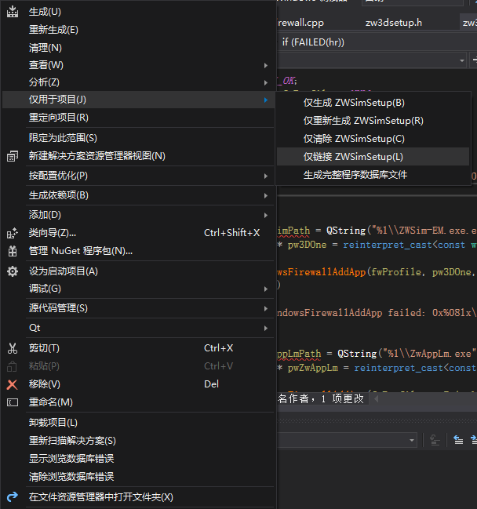

# 强制类型转换
---
## static_cast

## reinterpret_cast

## const_cast

## dynamic_cast

# 判断字符串是否为空
---
~~~C++
include <ctype.h>
isspaace(char_c);
/*
判断字符串否为空格字符，是则返回TRUE，否则返回FALSE
空格字符包括;空格、换行(\n)、归位键(\r)、水平(\t)/垂直(\v)定位字符、翻页(\f);
*/
~~~

# 获取环境变量的值
---
~~~C++
include <stdlib.h>
//char *getenv(const char *name)
getenv("appdata");
~~~

# 重定位流上的文件指针

---

~~~C++
int fseek( FILE *stream, long offset, int fromwhere );
/*
第一个参数stream为文件指针
第二个参数offset为偏移量，整数表示正向偏移，负数表示负向偏移
第三个参数origin设定从文件的哪里开始偏移,可能取值为：SEEK_CUR、 SEEK_END 或 SEEK_SET
SEEK_SET： 文件开头
SEEK_CUR： 当前位置
SEEK_END： 文件结尾
其中SEEK_SET,SEEK_CUR和SEEK_END和依次为0，1和2.
简言之：
fseek(fp,100L,0);把fp指针移动到离文件开头100字节处；
fseek(fp,100L,1);把fp指针移动到离文件当前位置100字节处；
fseek(fp,-100L,2);把fp指针退回到离文件结尾100字节处。

描 述: 函数设置文件指针stream的位置。如果执行成功，stream将指向以fromwhere为基准，偏移offset个字 节的位置。如果执行失败(比如offset超过文件自身大小)，则不改变stream指向的位置。
返回值: 成功，返回0，否则返回其他值。
*/
~~~
# 相对路径转绝对路径
---
~~~C++
char *realpath(const char *path, char *resolved_path)
~~~
# 后期生成事件不执行的原因
---

如图，右键项目->仅用于项目->仅链接即可；
# Vector使用for循环的几种遍历方法
---
## C++ 11 auto新特性
~~~C++
for(auto name:names)
{
    body=namn;
}
~~~
## 使用迭代器遍历

---

## 使用旧的C语言方法

---
# C++字符串的格式化
~~~C++
include <boost/format.hpp>
boost::format str("(%1%，%2%，%3%)");
str %str1 %int2 %flt3；
std::string Str=str.str();
~~~

# windows编程中 一些前缀区分

IDC_：控件的ID命名前缀（Control)

IDM_：菜单的ID命名前缀（Menu)

IDD_：对话框的ID命名前缀（Dialog)

IDR_：资源的ID命名前缀（Resource)

IDS_：字符串的ID命名前缀（String）

IDB_：位图资源的ID命名前缀（Bitmap）

# C++字符编码问题

1. _UNICODE和UNICODE必须同时声明或者同时不声明

~~~C++
#ifdef _UNICODE
#ifndef UNICODE
#define UNICODE
#endif
#endif
~~~

2. _UNICODE主要针对C运行库，UNICODE主要针对Windows头文件
3. \_T()和\_TEXT()完全等价，根据_UNICODE来确定宏,在tchar.h定义
4. TEXT()，根据UNICODE来确定宏，在winnt.h定义
5. \_T、\_TEXt()、TEXT()均是自动转换宽字符和多字节字符的宏
# QT使用socket实现进程间通信时中文乱码问题
1. 数据发送时利用toLocal8Bit()函数先将数据转为QByteArray格式；
2. 数据接收时利用fromlocal8bit()函数将读取到的QByteArray格式数据再转为QString格式
如此可解决传输中文字符串乱码问题；

# 布尔类型是C++才有的，C语言没有布尔类型；

`static`

