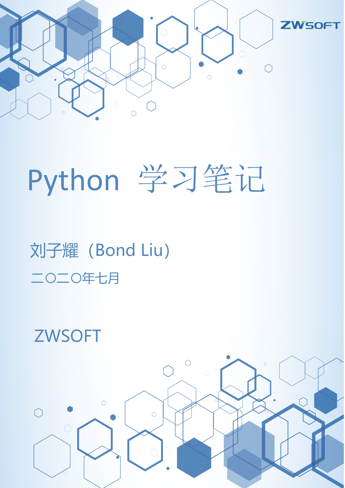

# Python模块

## os模块

### 常用属性

| os模块常用属性| 属性简介|
| :----------------------- | ---------------------- |
| os.name | 返回电脑的操作系统类型（Windows)返回“nt”） |
| os.curdir| 当前工作目录即：’.’ |
| os.sep| 返回路径分隔符，’\’\’ |
| os.extsep| 返回文件扩展名分隔符，Windows下则返回’.’|
| os.linesep | 返回文本文件行分隔符，即’\\n\\r’ |

### 常用方法：

#### os模块

|常用方法 | 方法简介 |
| :------------------- | :------------- |
| os.remove()| 删除文件 |
| os.unlink()| 删除文件 |
| os.rename()| 重命名文件 |
| os.listdir() | 列出指定目录下所有文件|
| os.chdir() | 改变当前工作目录 |
| os.getcwd()| 获取当前工作目录 |
| os.mkdir() | 新建一级目录|
| os.rmdir() | 删除空目录(删除非空目录, 使用shutil.rmtree()) |
| os.makedirs()| 创建多级目录|
| os.removedirs() | 删除多级目录|
| os.stat(file)| 获取文件属性|
| os.chmod(file)| 修改文件权限|
| os.utime(file)| 修改文件时间戳 |
| os.name(file)| 获取操作系统标识 |
| os.system()| 执行操作系统命令 |
| os.popen()| 执行操作系统命令，并接收返回值 |
| os.execvp()| 启动一个新进程 |
| os.fork()| 获取父进程ID，在子进程返回中返回0 |
| os.execvp()| 执行外部程序脚本（Uinx）|
| os.spawn() | 执行外部程序脚本（Windows）|
| os.access(path, mode) | 判断文件权限(详细参考cnblogs)|
| os.wait()| 暂时未知 |

#### os.path模块

|常用方法|方法简介|
| :--------------- | :-------------- |
| os.path.basename(filename) | 返回文件路径的文件名部分|
| os.path.join(dirname,basename) | 将文件路径和文件名凑成完整文件路径 |
| os.path.abspath(name) | 获得绝对路径|
| os.path.splitunc(path)| 把路径分割为挂载点和文件名 |
| os.path.normpath(path)| 规范path字符串形式 |
| os.path.exists() | 判断文件或目录是否存在 |
| os.path.isabs()| 如果path是绝对路径，返回True |
| os.path.realpath(path)| 返回path的真实路径 |
| os.path.relpath(path,[start])| 从start开始计算相对路径,start为空则默认从当前 工作目录开始 |
| os.path.normcase(path)| 转换path的大小写和斜杠 |
| os.path.isdir()| 判断name是不是一个目录，name不是目录就 返回false|
| os.path.isfile() | 判断name是不是一个文件，不存在返回false |
| os.path.islink() | 判断文件是否连接文件,返回boolean |
| os.path.ismount()| 指定路径是否存在且为一个挂载点，返回boolean|
| os.path.samefile() | 是否相同路径的文件，返回boolean|
| os.path.getatime() | 返回最近访问时间 浮点型|
| os.path.getmtime() | 返回上一次修改时间 浮点型|
| os.path.getctime() | 返回文件创建时间 浮点型|
| os.path.getsize()| 返回文件大小 字节单位|
| os.path.commonprefix(list)| 返回list(多个路径)中，所有path共有的最长的路径 |
| os.path.lexists()| 路径存在则返回True,路径损坏也返回True |
| os.path.expanduser(path)| 把path中包含的”~”和”~user”转换成用户目录|
| os.path.expandvars(path)| 根据环境变量的值替换path中包含的"\$name"和 "\${name}"|
| os.path.sameopenfile(fp1,fp2)| 判断fp1和fp2是否指向同一文件 |
| os.path.samestat(stat1,stat2)| 判断stat tuple stat1和stat2是否指向同一个文件|
| os.path.splitdrive(path)| 一般用在windows下，返回驱动器名和路径 组成的元组|
| os.path.walk(path, visit,arg)| 遍历path，给每个path执行一个函数详细见手册 |
| os.path.supports_unicode_filenames() | 设置是否支持unicode路径名|

## sys模块

| 常用方法 | 方法简介|
| :--------- | :-------------- |
| sys.argv | 命令行参数List，第一个元素是程序本身路径,实现从程序 外部向程序传递参数|
| sys.path | 返回模块的搜索路径，初始化时使用PYTHONPATH环境 变量的值 |
| sys.modules.values| 返回系统导入的模块字段，key是模块名，value是模块|
| sys.stdout | 标准输出|
| sys.stdin| 标准输入|
| sys.stderr | 错误输出|
| sys.exec_prefix | 返回平台独立的python文件安装的位置|
| sys.copyright | 记录python版权相关的东西 |
| sys.api_version | 解释器的C的API版本 |
| sys.executable| Python解释程序路径 |
| sys.version_info| ‘final‘表示最终,也有‘candidate‘表示候选， 表示版本级别，是否有后继的发行 |
| sys.byteorder | 本地字节规则的指示器，big-endian平台的值是‘big‘, little-endian平台的值是‘little‘ |
| sys.modules.keys()| 返回所有已经导入的模块列表|
| sys.exit(n)| 退出程序，正常退出时exit(0) |
| sys.hexversion| 获取Python解释程序的版本值，16进制格式如： 0x020403F0|
| sys.version| 获取Python解释程序的版本信息|
| sys.platform| 返回操作系统平台名称 |
| sys.stdout.write(‘aaa‘)| 标准输出内容|
| sys.stdout.writelines()| 无换行输出|
| sys.stdin.read()| 输入一行|
| sys.stdin.readline()| 从标准输入读一行，sys.stdout.write(“a”)屏幕输出a|
| sys.exc_clear() | 用来清除当前线程所出现的当前的或最近的错误信息|
| sys.getdefaultencoding() | 返回当前你所用的默认的字符编码格式|
| sys.getfilesystemencoding()| 返回将Unicode文件名转换成系统文件名的编码的名字|
| sys.builtin_module_names | Python解释器导入的内建模块列表|
| sys.getwindowsversion()| 获取Windows的版本|
| sys.setdefaultencoding(name) | 用来设置当前默认的字符编码(详细使用参考文档)|
| sys.displayhook(value) | 如果value非空，这个函数会把他输出到sys.stdout (详细使用参考文档) |
| sys.exc_info()| 获取当前正在处理的异常类,exc_type、exc_value、 exc_traceback当前处理的异常详细信息 |

## shutil模块

| 常用方法 | 方法简介|
| :---------------------------- | ----------------------------------------------- |
| shutil.copyfileobj(src,dst[, length=16\*1024]) | 将src的内容覆盖copy给dst(先open得到fileobj), length为dst每次读取的长度，用做缓冲区大小 |
|shutil.copyfile(src,dst)|将src文件内容复制至dst文件|
|shutil.copymode(src, dst)|将src文件权限复制至dst(必须存在)文件。 文件内容，所有者和组不受影响|
|shutil.copystat(src, dst)|将权限，上次访问时间，上次修改时间 以及src的标志复制到dst(必须存在)。 文件内容，所有者和组不受影响|
|shutil.copy(src, dst)|会在dst目录下创建与src同名的文件， 若该目录下存在同名文件，将会报错提示已经 存在同名文件。权限会被一并复制。本质是 先后调用了copyfile与copymode而已|
|shutil.copy2(src, dst)|会在dst录下创建与src同名的文件，若该目录下 存在同名文件，将会报错提示已经存在同名文件。 权限、上次访问时间、上次修改时间 和src的标志会一并复制至dst。 本质是先后调用了copyfile与copystat方法而已|
|shutil.ignore_patterns(*patterns)|忽略模式，用于配合copytree()方法，传递文件 将会被忽略，不会被拷贝 patterns：文件名称（元祖）|
|shutil.copytree(src, dst, symlinks=False,  ignore=None)|将src文件夹里的所有内容拷贝至dst文件夹|
|shutil.rmtree(path, ignore_errors=False,  onerror=None)|ignore_errors：是否忽略错误，默认False onerror：定义错误处理函数，需传递一个可 执行的处理函数，该处理函数接收三个参数： 函数、路径和excinfo|
|shutil.move(src, dst)|将src移动至dst目录下。若dst目录不存在， 则效果等同于src改名为dst。若dst目录存在， 将会把src文件夹的所有内容移动至该目录下面|
|shutil.disk_usage(path)|获取当前目录所在硬盘使用情况|
|shutil.chown(path, user=None,  group=None)|修改路径指向的文件或文件夹的所有者或分组 path：路径 user：所有者，传递user的值必须是真实的， 否则将报错no such user group：分组，传递group的值必须是真实的， 否则将报错no such group|
|shutil.which(cmd,  mode=os.F_OK,os.X_OK,  path=None)|获取给定的cmd命令的可执行文件的路径|
|shutil.make_archive(base_name,  format, root_dir, …)|生成压缩文件 base_name：压缩文件的文件名，不含扩展名， 因为会根据压缩格式生成相应的扩展名 format：压缩格式 root_dir：将制定文件夹进行压缩|
|shutil.get_archive_formats()|获取支持的压缩文件格式。目前支持的有： tar、zip、gztar、bztar、xztar|
|shutil.unpack_archive(filename,  extract_dir=None, format=None)|解压操作。 filename：文件路径 extract_dir：解压至的文件夹路径。不存在则自动生成 format：解压格式，默认为None， 会根据扩展名自动选择解压格式|
|shutil.get_unpack_formats()|获取支持的解压文件格式。目前支持的有： tar、zip、gztar、bztar和xztar|

## string模块
|常用方法|方法简介|
|--------------------------------|------------------------------------------------------------|
|str.capitalize()|把字符串的第一个字符大写|
|str.center(width)|返回一个原字符串居中，并使用空格填充到width长度的新字符串|
|str.ljust(width)|返回一个原字符串左对齐，用空格填充到指定长度的新字符串|
|str.rjust(width)|返回一个原字符串右对齐，用空格填充到指定长度的新字符串|
|str.zfill(width)|返回字符串右对齐，前面用0填充到指定长度的新字符串|
|str.count(str,[beg,len])|返回子字符串在原字符串出现次数，beg,len是范围|
|str.decode(encodeing[,replace])|将以指定格式编码的string解码为Unicode格式,出错引发ValueError异常，‘ignore‘, ‘replace‘, ‘xmlcharrefreplace‘, ‘backslashreplace‘ 以及通过 codecs.register_error() 注册的任何值。|
|str.encode(encodeing[,replace])|将Unicode编码的string以指定格式编码|
|str.endswith(substr[,beg,end])|字符串是否以substr结束，beg,end是范围|
|str.startswith(substr[,beg,end])|字符串是否以substr开头，beg,end是范围|
|str.expandtabs(tabsize=8)|把字符串的tab转为空格，默认为8个|
|str.find(str,[stat,end])|查找子字符串在字符串第一次出现的位置，否则返回-1|
|str.index(str,[beg,end])|查找子字符串在指定字符中的位置，不存在报异常|
|str.isalnum()|检查字符串是否以字母和数字组成，是返回true否则False|
|str.isalpha()|检查字符串是否以纯字母组成，是返回true,否则false|
|str.isdecimal()|检查字符串是否以纯十进制数字组成，返回布尔值|
|str.isdigit()|检查字符串是否以纯数字组成，返回布尔值|
|str.islower()|检查字符串是否全是小写，返回布尔值|
|str.isupper()|检查字符串是否全是大写，返回布尔值|
|str.isnumeric()|检查字符串是否只包含数字字符，返回布尔值|
|str.isspace()|如果str中只包含空格，则返回true,否则FALSE|
|str.title()|(返回标题化的字符串（所有单词首字母大写，其余小写）|
|str.istitle()|返回标题化的字符串(所有单词首字母大写，其余小写)|
|str.join(seq)|以str作为连接符，将一个序列中的元素连接成字符串|
|str.split(str=‘‘,num)|以str作为分隔符，将一个字符串分隔成一个序列，num是被分隔的字符串|
|str.splitlines(num)|以行分隔，返回各行内容作为元素的列表|
|str.lower()|将大写转为小写|
|str.upper()|转换字符串的小写为大写|
|str.swapcase()|翻换字符串的大小写|
|str.lstrip()|去掉字符左边的空格和回车换行符|
|str.rstrip()|去掉字符右边的空格和回车换行符|
|str.strip()|去掉字符两边的空格和回车换行符|
|str.partition(substr)|从substr出现的第一个位置起，将str分割成一个3元组。|
|str.replace(str1,str2,num)|查找str1替换成str2，num是替换次数|
|str.rfind(str[,beg,end])|从右边开始查询子字符串|
|str.rindex(str,[beg,end])|从右边开始查找子字符串位置|
|str.rpartition(str)|类似partition函数，不过从右边开始查找|
|str.translate(str,del=‘‘)|按str给出的表转换string的字符，del是要过虑的字符|