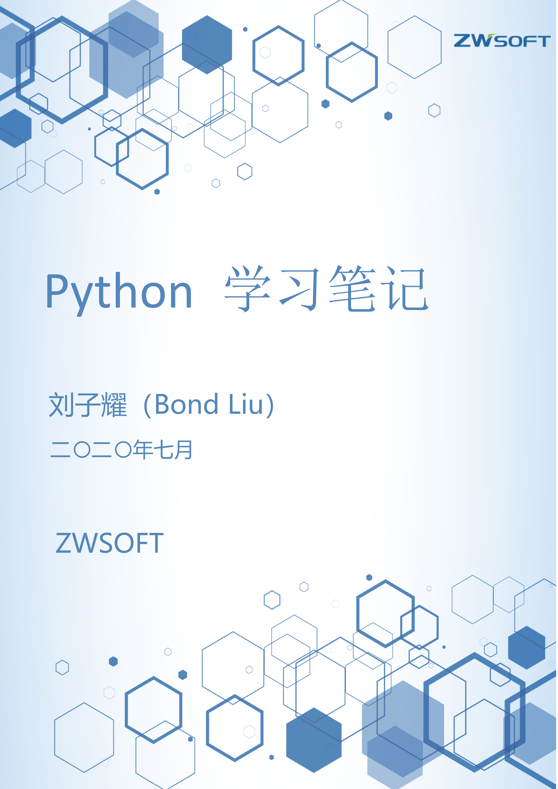

---
output:
  pdf_document:
    pdf-engine: xelatex
    citation_package: biblatex
    template: pandoc.template
---

# Python模块

## os模块

### os模块的部分常用属性（Windows）

| os模块常用属性| 属性简介|
| :----------------------- | :---------------------- |
| os.name | 返回电脑的操作系统类型（Windows返回“nt”） |
| os.curdir| 当前工作目录即：’.’ |
| os.sep| 返回路径分隔符，’\’\’ |
| os.extsep| 返回文件扩展名分隔符，Windows下则返回’.’|
| os.linesep | 返回文本文件行分隔符，即’\\n\\r’ |

### os模块常用方法

|常用方法 | 方法简介 |
| :------------------- | :------------- |
| os.remove()| 删除文件 |
| os.unlink()| 删除文件 |
| os.rename()| 重命名文件 |
| os.listdir() | 列出指定目录下所有文件|
| os.chdir() | 改变当前工作目录 |
| os.getcwd()| 获取当前工作目录 |
| os.mkdir() | 新建一级目录|
| os.rmdir() | 删除空目录(删除非空目录, 使用shutil.rmtree()) |
| os.makedirs()| 创建多级目录|
| os.removedirs() | 删除多级目录|
| os.stat(file)| 获取文件属性|
| os.chmod(file)| 修改文件权限|
| os.utime(file)| 修改文件时间戳 |
| os.name(file)| 获取操作系统标识 |
| os.system()| 执行操作系统命令 |
| os.execvp()| 启动一个新进程 |
| os.fork()| 获取父进程ID，在子进程返回中返回0 |
| os.execvp()| 执行外部程序脚本（Uinx）|
| os.spawn() | 执行外部程序脚本（Windows）|
| os.access(path, mode) | 判断文件权限(详细参考cnblogs)|
| os.wait()| 暂时未知 |

#### os.path模块常用方法

|常用方法|方法简介|
| :--------------- | :-------------- |
| os.path.basename(filename) | 返回文件路径的文件名部分|
| os.path.join(dirname,basename) | 将文件路径和文件名凑成完整文件路径 |
| os.path.abspath(name) | 获得绝对路径|
| os.path.splitunc(path)| 把路径分割为挂载点和文件名 |
| os.path.normpath(path)| 规范path字符串形式 |
| os.path.exists() | 判断文件或目录是否存在 |
| os.path.isabs()| 如果path是绝对路径，返回True |
| os.path.realpath(path)| 返回path的真实路径 |
| os.path.relpath(path,[start])| 从start开始计算相对路径,start为空则默认从当前 工作目录开始 |
| os.path.normcase(path)| 转换path的大小写和斜杠 |
| os.path.isdir()| 判断name是不是一个目录，name不是目录就 返回false|
| os.path.isfile() | 判断name是不是一个文件，不存在返回false |
| os.path.islink() | 判断文件是否连接文件,返回boolean |
| os.path.ismount()| 指定路径是否存在且为一个挂载点，返回boolean|
| os.path.samefile() | 是否相同路径的文件，返回boolean|
| os.path.getatime() | 返回最近访问时间 浮点型|
| os.path.getmtime() | 返回上一次修改时间 浮点型|
| os.path.getctime() | 返回文件创建时间 浮点型|
| os.path.getsize()| 返回文件大小 字节单位|
| os.path.commonprefix(list)| 返回list(多个路径)中，所有path共有的最长的路径 |
| os.path.lexists()| 路径存在则返回True,路径损坏也返回True |
| os.path.expanduser(path)| 把path中包含的”~”和”~user”转换成用户目录|
| os.path.expandvars(path)| 根据环境变量的值替换path中包含的"\$name"和 "\${name}"|
| os.path.sameopenfile(fp1,fp2)| 判断fp1和fp2是否指向同一文件 |
| os.path.samestat(stat1,stat2)| 判断stat tuple stat1和stat2是否指向同一个文件|
| os.path.splitdrive(path)| 一般用在windows下，返回驱动器名和路径 组成的元组|
| os.path.walk(path, visit,arg)| 遍历path，给每个path执行一个函数详细见手册 |
| os.path.supports_unicode_filenames() | 设置是否支持unicode路径名|

## sys模块

| 常用方法 | 方法简介|
| :--------- | :-------------- |
| sys.argv | 命令行参数List，第一个元素是程序本身路径,实现从程序 外部向程序传递参数|
| sys.path | 返回模块的搜索路径，初始化时使用PYTHONPATH环境 变量的值 |
| sys.modules.values| 返回系统导入的模块字段，key是模块名，value是模块|
| sys.stdout | 标准输出|
| sys.stdin| 标准输入|
| sys.stderr | 错误输出|
| sys.exec_prefix | 返回平台独立的python文件安装的位置|
| sys.copyright | 记录python版权相关的东西 |
| sys.api_version | 解释器的C的API版本 |
| sys.executable| Python解释程序路径 |
| sys.version_info| ‘final‘表示最终,也有‘candidate‘表示候选， 表示版本级别，是否有后继的发行 |
| sys.byteorder | 本地字节规则的指示器，big-endian平台的值是‘big‘, little-endian平台的值是‘little‘ |
| sys.modules.keys()| 返回所有已经导入的模块列表|
| sys.exit(n)| 退出程序，正常退出时exit(0) |
| sys.hexversion| 获取Python解释程序的版本值，16进制格式如： 0x020403F0|
| sys.version| 获取Python解释程序的版本信息|
| sys.platform| 返回操作系统平台名称 |
| sys.stdout.write(‘aaa‘)| 标准输出内容|
| sys.stdout.writelines()| 无换行输出|
| sys.stdin.read()| 输入一行|
| sys.stdin.readline()| 从标准输入读一行，sys.stdout.write(“a”)屏幕输出a|
| sys.exc_clear() | 用来清除当前线程所出现的当前的或最近的错误信息|
| sys.getdefaultencoding() | 返回当前你所用的默认的字符编码格式|
| sys.getfilesystemencoding()| 返回将Unicode文件名转换成系统文件名的编码的名字|
| sys.builtin_module_names | Python解释器导入的内建模块列表|
| sys.getwindowsversion()| 获取Windows的版本|
| sys.setdefaultencoding(name) | 用来设置当前默认的字符编码(详细使用参考文档)|
| sys.displayhook(value) | 如果value非空，这个函数会把他输出到sys.stdout (详细使用参考文档) |
| sys.exc_info()| 获取当前正在处理的异常类,exc_type、exc_value、 exc_traceback当前处理的异常详细信息 |

## shutil模块

| 常用方法 | 方法简介|
| :---------------------------- | ----------------------------------------------- |
| shutil.copyfileobj(文件1，文件2) | 将文件1的数据覆盖copy给文件2(先open得到fileobj) |
