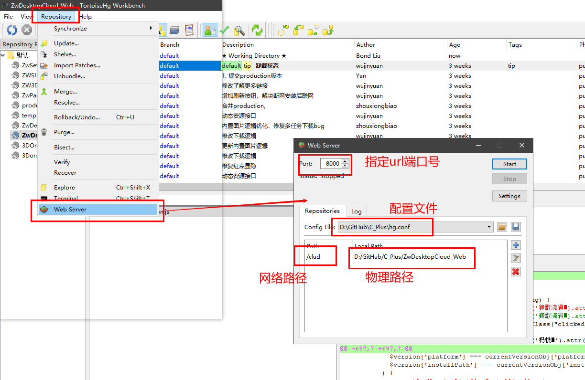

<h4 style="text-align:center">工作笔记<h4>

##### 常用命令行

1、查看端口号占用进程：

~~~C++
netstat -ano|findstr 1234
~~~

2、查看IP地址：

~~~C++
ipconfig          //只返回当前使用的ip信息
ipconfig /all    //返回所有网络配置信息
~~~

3、 PowerShell查看磁盘信息(类型)：

~~~C++
Get-PhysicalDisk
~~~

4、 切换目录

~~~C++
cd 目录     //本磁盘切换工作目录
cd /d 目录  //跨磁盘切换工作目录
盘符:       //切换磁盘
~~~

##### HG使用技巧

**1、**HG拉取代码失败报错：```wait for lock on [direction]  by process```

**解决方案：**

删除仓库`.hg`或者`.hg\store`下的lock文件即可；

**2、**HG建立远程仓库的方法：

- 建立hg远程仓库
- 启动hg`Web Server`



- 配置文件内容：

  ```C++
  [paths]
  Zw/QA/FTP/Client = D:\FTP\FTP-Client     //等号前为网络路径，等号后为物理路径
  Zw/QA/FTP/Server = D:\FTP\FTP-Server     //一个server可以配置多个仓库
  
  
  [web]
  push_ssl = False
  allow_push = *                           //设置推送权限
  ```

  

- 设置开机启动：
  - 写好开机启动脚本`.bat`并保存
  - 创建脚本快捷方式
  - 将快捷方式复制到`C:\ProgramData\Microsoft\Windows\Start Menu\Programs\StartUp`即可

- 开机启动脚本内容：

  ```C++
  hg serve --webdir-conf=hgweb.conf --port 8100 --accesslog accesslog.txt
  pause
  ```

  

**3、**HG``.hgignore``文件的书写规则

- 忽略特定类型文件：

  ~~~shell
  /.txt$
  ~~~

- 忽略特定文件夹：

  ~~~shell
  folder/
  ~~~
  
- ``glob``全局属性的用法：

  全局根植于当前目录：``glob``（例如:``.c``）将仅匹配当前目录中以``.c``结尾的文件。

  支持的``glob``语法扩展名是``**``，以匹配路径分隔符之间的任何字符串

  ```Chm
  syntax: glob
  glob:
  *.c       any name ending in ".c" in the current directory
  *.c            any name ending in ".c" in the current directory
  **.c           any name ending in ".c" in any subdirectory of the
                 current directory including itself.
  ```

**4、**HG命令的使用方法

- 详细全面的命令解释通过命令行查看：

  ```shell
  hg help
  ```

  - 创建仓库：
  
    ```shell
    hg init dir
    #在指定目录创建仓库
    ```
  
  - 克隆仓库：
  
    ```shell
    hg clon url dir
    #在指定目录克隆指定源的仓库
    ```
  
  - 清理仓库：
  
    ```shell
    hg purge --all
    #清理仓库
    ```
  
  - 创建分支：
  
    ```shell
    hg branch branchname
    #创建新分支（下次提交才生效）
    ```
  
  - 切换分支：
  
    ```shell
    hg update branchname --clean
    #更新分支、切换分支，忽略本地更改
  
  - 提交分支：
  
    ```shell
    hg commit -m message -addremove
    #在提交之前将'新的/丢失的'文件标记为'已增加/已删除'
  
  - 推送分支：
  
    ```shell
    hg push --new-branch -b branchname url
    #远程推送新分支
    hg push -b branchname url
    #远程推送分支
    ```
  
  - 拉取分支：
  
    ```shell
    hg pull -b branch url
    #拉取分支
    ```
  
  ***注意：***HG命令执行结果的返回值：如果成功执行返回值为：``0``；执行失败一般返回：``1``，有可能返回其他值
  
  **5、**HG角标注册表
  
  ```shell
  HKEY_LOCAL_MACHINE\SOFTWARE\Microsoft\Windows\CurrentVersion\Explorer\ShellIconOverlayIdentifiers
  ```

##### .bat(.cmd)脚本语法

  **1、**执行后处理脚本时报错：

- 不能执行循环复制

  ~~~shell
  set outdir=..\Build\%platform%\%configuration%
  xcopy /s /r /i /y /q ..\qt.conf 			%outdir%     
  # /s 表示的是将..\目录（包括子目录）下的qt.congf文件复制到outdir，因为目标文件夹是..\的子文件夹，因此形成了循环复制bia
  # /y 表示禁止提示以确认改写一个现存的目标文件，默认直接覆盖
  # /r 表示改写只读文件
  # /i 表示如果目标不存在，又在复制一个以上的文件， 则假定目标一定是一个目录
  # /q 表示复制时不显示文件名
  ~~~

  ***解决方案：***

  ~~~shell
  set outdir=..\Build\%platform%\%configuration%
  xcopy /r /i /y /q ..\config\qt.conf 		%outdir%     #去掉/s参数即可
  或
  xcopy /s /r /i /y /q ..\config\qt.conf 		%outdir%     #需要再建一级文件夹即可
  ~~~

  

- 文件名还是目录名?(F = 文件 D = 目录)
  ~~~shell
  xcopy /s /r /i /y /q C:\Qt\Qt5.9.7\5.9.7\msvc2015\plugins\printsupport\windowsprintersupport.dll  %outdir%\printsupport
  xcopy /s /r /i /y /q C:\Qt\Qt5.9.7\5.9.7\msvc2015\resources 	%outdir%\resources
  ~~~

  ***解决方案：***

  ~~~shell
  xcopy /s /r /i /y /q C:\Qt\Qt5.9.7\5.9.7\msvc2015\plugins\printsupport\windowsprintersupport.dll  %outdir%\printsupport\
  xcopy /s /r /i /y /q C:\Qt\Qt5.9.7\5.9.7\msvc2015\resources\ 	%outdir%\resources\
  #末尾加个\即可，表示此为文件夹
  ~~~

  **2、**``.bat``常用命令

- 获取上一条命令的执行返回值:``%errorlevel%``

- 表示当前目录：``.\``或者``%cd%``

- 表示脚本文件所在目录：``%~dp0``

- ``RD:``删除文件夹

- ``del:``删除文件

  ```shell
  set config=Production
  set platform=x64
  REM set platform=Win32
  set version=1.0
  set url=http://192.168.1.24:2021/QA/FunctionTest/Edu/ZWDESKTOPRESULT
  REM set SourcePath="%cd%
  REM 当前目录
  set SourcePath="%~dp0
  REM 脚本所在目录
  set BuildPath=%SourcePath%Build
  set ProductionPath=%BuildPath%\%platform%\%config%\
  set destinationPath=%SourcePath%..\ZwDesktopCloudResult
  set devenvPath="C:\Program Files (x86)\Microsoft Visual Studio\2017\Professional\Common7\IDE
  set branch=ZwDesktopCloud_%version%_%platform%
  set currentBranch=%branch%
  
  if exist %BuildPath%" (
  REM 注意括号和关键词前后均有一个空格，否则会报语法错误
  	RD /S /Q %BuildPath%
  	RD /s /q %SourcePath%Temp
  )
  REM 删除Build目录
  %devenvPath%\devenv.exe" %SourcePath%ZwDesktopCloud.sln" /Rebuild "%config%|%platform%"
  REM 编译项目
  
  if not exist %destinationPath%" (
  	md %destinationPath%
  	hg clon %url% %destinationPath%
  )else (
  	if not exist %destinationpath%\.hg" (
  		rd /s /q %destinationPath%
  		md %destinationPath%
  		hg clon %url% %destinationPath%
  	)
  )
  REM 若不存在项目提交目录，则创建一个目录并拉取远程仓库,如果存在目录，但不是仓库，则清空目录
  
  if exist %destinationpath%\.hg" (
  	cd /d %destinationPath%
  	goto :HGDeal
  )
  
  :HGDeal
  hg pull %url%
  hg update -C %branch%
  if %errorlevel% neq 0 (
  REM 获取上一条命令执行的返回值
  	hg update -C "default"
  	set currentBranch=default
  )
  :HGDealend
  
  REM 更新仓库到最新节点
  dir /a-d /b >%temp%\delFile.txt
  REM 获取当前目录下的非目录项的名称，并写入txt文件
  dir /ad /b >%temp%\delDir.txt
  REM 获取当前目录下的子目录的名称，并写入txt文件
  
  for /f %%x in (%temp%\delDir.txt)do (
  	if %%x neq .hg (
  		rd /s /q %%x
  	)
  )
  REM 删除除HG系统文件夹以外的其他文件夹·
  for /f %%x in (%temp%\delFile.txt)do (
  	if %%x neq .hgignore (
  		del /q %%x
  	)
  )
  REM 删除除HG系统文件以外的其他文件·
  REM 无法删除名称带有空格的额文件及文件夹
  del /q %temp%\delFile.txt
  del /q %temp%\delDir.txt
  xcopy /s /r /i /y /q  %ProductionPath%" %destinationPath%"
  REM copy 编译结果到目标仓库
  
  if %currentBranch% == default (
  	hg branch %branch%
  	hg commit -A -m %branch%
  	REM 本地提交编译结果
  	hg push --new-branch -b %branch% %url%
  	REM 远程推送编译结果
  )else (
  	hg commit -A -m %branch%
  	REM 本地提交编译结果
  	hg push -b %branch% %url%
  	REM 远程推送编译结果
  )
  REM 如果分支不存在，则基于default新建一条分支
  
  cd /d %SourcePath%


